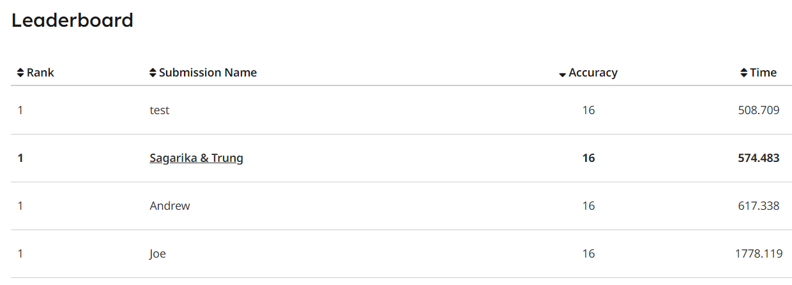
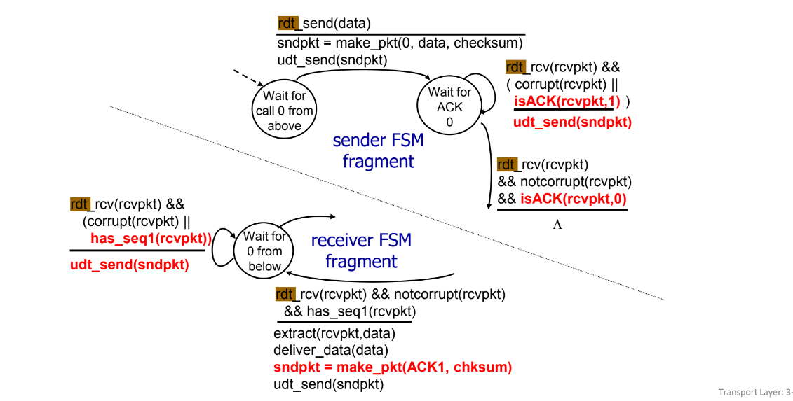
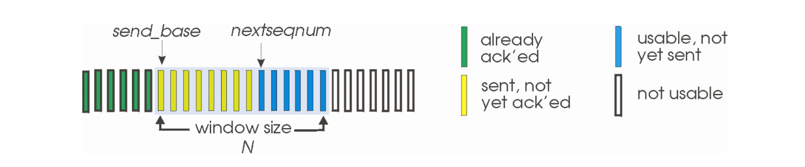

# Transmission Control Protocol (TCP) with GBN and Dynamic RTO

This repository provides the source code to the Transmission Control Protocol that I developed in [UMass Amherst CS453: Computer Network](https://sites.google.com/view/cs43-s22/overview?authuser=0). The full blog post can be found at [dmtrung.com](https://dmtrung.com/blogs/network_programming.html)

The project requires a fast and resilient sender for TCP.  Unlike [the first project](https://bitbucket.org/compnetworks/csp2p-downloader/src/master/README.md), there is no time limit for the second project, except Gradescope runtime limit. Howver, accuracy will be heavily evaluated using 16 tests of incrementing difficulty and noisy levels, with corruption rate `> 0.5` for the last few tests. The real numbers were not disclosed. By using the Go-Back-N (GBN) protocol and dynamically adjusting the Recovery Time Objective (RTO), I again achieved the best score of the class (the first time was in [cs453-project1](https://github.com/dmtrung14-courses/umass-cs453)). Kudos to my fellow teammate [Sagarika](https://github.com/sagarikasonni)!

***For UMass students**: Winning this TCP minicontest comes with a generous amount of extra credit as well!*

## Contents
- [Overview](#overview)
    - [Reliable Data Transfer (RDT)](#reliable-data-transfer-rdt)
    - [Pipelining using GBN](#pipelining-using-gbn)
    - [TCP Congestion Control](#tcp-congestion-control)
- [FAQs](#faqs)
- [Installation](#installation)
- [Release Statement](#release-statement)

## Overview
### Reliable Data Transfer (RDT)

Unlike the UDP protocol wherein the sender blasts datagrams at the receiver, RDT protocols requires the data to be received in an appropriate order. This is challenging in the setting of noisy networks with possibility of losses and corruptions.

In the case of network corruption, it is important to have a way to acknowledge the reception of accurate information. This is achieved through [ACK / NAK](https://en.wikipedia.org/wiki/Acknowledgement_(data_networks)). An ACK is sent in the event of not corrupted message, and a NAK otherwise. NAK, however, is not required, as the recipient can simply acknowledge the sequence number of the next anticipated packet. In this project I provide a NAK-free implementation.

In the case of losses, the recipient may never receive the message at all. Therefore, the sender must somehow be able to detect a loss event. This is achievable through timeouts. If the sender does not receive a respond from the receiver after a time $T$, it assumes that a loss has occured, and resends the message.

The transmission protocol can be represented as the following [Finite State Machine](https://en.wikipedia.org/wiki/Finite-state_machine) of [RDT 2.2](https://www.geeksforgeeks.org/reliable-data-transfer-rdt-2-2/?ref=ml_lbp). Note that there are multiple layers to Reliable Data Transfer, which are listed [here](https://www.geeksforgeeks.org/principle-of-reliable-data-transfer-protocol/?ref=ml_lbp)

### Pipelining using GBN

In the Finite State Machine given above, message sequence numbers can increment gradually. However, there is no pipelining to this procedure. (i.e. packet will not be sent unless the previous packet has been ACKed and the ACK is successfully received.)

This can be modified by using the **Go-Back-N** Protocol. In the GBN protocol, the sender sends N continguous data chunks to the receiver. When the receiver have ACKed all data chunks up to index $i$, the sender will continue to send $n+1, n+2, \cdots, n+i$. However, if at any point a packet $j$ timeouts (convince yourself that this is also the earliest un-ACKed packet), then it will resend all packets $j, j+1, \cdots, j+n-1$, hence the name Go-Back-N.

### TCP Congestion Control

Another feature is of RDT is timeout. It is important to have a timeout algorithm that takes into account the current network status rather than a hard-coded value. We use the algorithm specified in [RFC 6298](https://datatracker.ietf.org/doc/html/rfc6298) to calculate the retransmission time.

To compute the current RTO, given the most recent round trip time $R'$, we calculate the smoothed current round trip time using Exponential Moving Average

$$SRTT = (1-\alpha)*SRTT + \alpha R'$$
and the variance of the round trip time is given by:
$$VAR = (1 - \beta) * VAR + \beta * |SRTT - R'|$$

choosing $\alpha = 0.125, \beta = 0.25$, and let $G$ be the clock granularity of the network, RTO is given by:
$$RTO = SRTT + \max (G, 4*RTTVAR)$$

In the event of a loss, RTO is doubled and capped at 6 seconds (as opposed to 60 seconds in RFC 6298).

$$RTO = \min(6, 2*RTO)$$

## FAQs
Refer [here](https://bitbucket.org/compnetworks/reliabletransport/src/master/README.md#markdown-header-tips-faqs-etc) for Frequently Asked Questions

## Installation

All the packages used in this project are from Python standard library, so if you have `Python >= 3.8`, you will be fine.

The server might not be running all year long, but the source code can be found [here](https://bitbucket.org/compnetworks/reliabletransport/src/master/) or locally at `ChannelEmulator.java`. Instructions on how to tune the channel characteristics can be found [here](https://bitbucket.org/compnetworks/reliabletransport/src/master/#markdown-header-channel-characteristics).

## Release Statement
This project is open to all, provided as is, and will not receive further updates. The code provided here is based on the requirements from the coursework and other personal improvements. 

*For UMass Amherst students*: I am strongly against academic dishonesty and highly recommend students who will take this course in the future treat this source code as a referrence rather than blatantly copy it. I do not take responsibility for any consequences of unauthorized reproduction of this repository.
